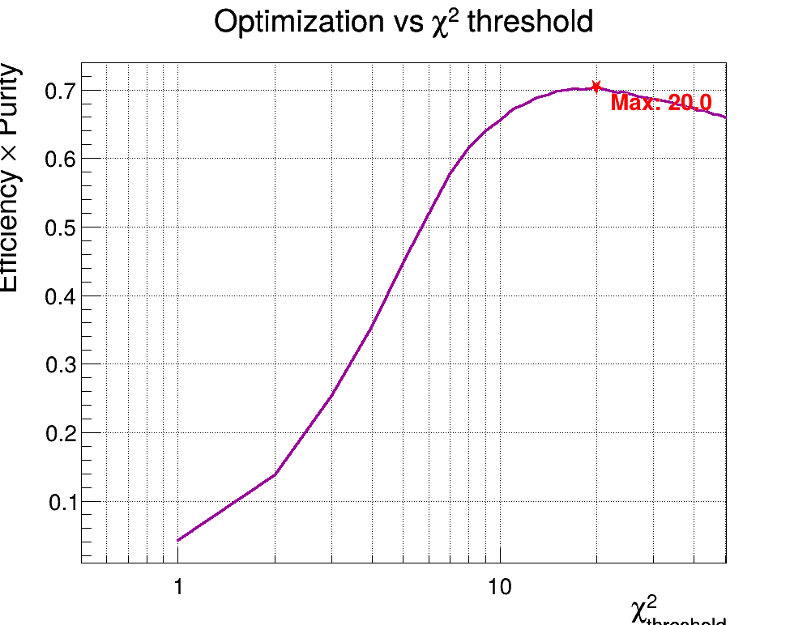
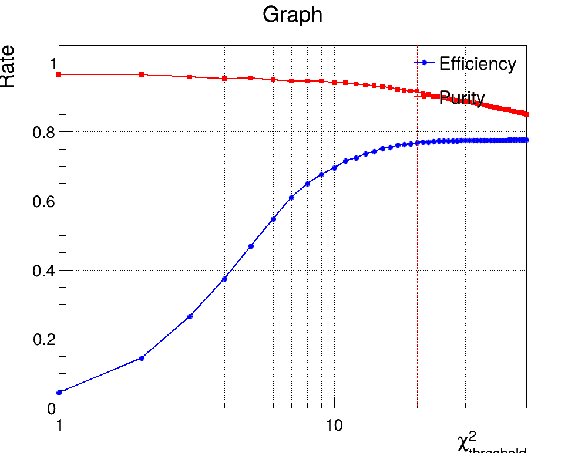

> #### Results section 
> verbose phrase at beginning
> ##### integrated metrics
>       variable of eff, purity, and the Efficiency: 0.75445

>       Efficiency: 0.75445
>       Purity: 0.447235
>       
>       TotalType0: 3345
>       nMatchedType3: 1441
>       nTrueType0: 1496
>       nTotalType3: 1910
>       
>       then a verbose phrase to descrive what's happening

> ##### differenctal metrics 
>       plots 1D ( only , 2D will not be shown )
>MFT: 
> combined eff_purity _ ___ Pt
> combined eff_purity _ ___ phi
> combined eff_purity _ ___ eta 
> combined eff_purity _ ___ chi2
> combined eff_purity _ ___ ncluster

>optimyzation: 
> chi2_scan_eff_purity
> chi2_optimyzation

> ##### statistical limitation
> based on figure 

------

### 4. Results and Discussion

#### 4.1 Integrated Performance Metrics
The integrated performance metrics provide a comprehensive overview of the MCH-MFT track matching algorithm's effectiveness.

**Efficiency:** ε = 0.754  
**Purity:** P = 0.447  

A detailed event count is recorded in the following four variables:
| Metric | Value | Description |
|--------|-------|-------------|
| nTotalType3 | 1910 | Total MCH-MID tracks in acceptance |
| nMatchedType3 | 1441 | Correctly matched true tracks |
| nTotalType0 | 3345 | Total selected global muons |
| nTrueType0 | 1496 | True global muon matches |

The integrated efficiency of 75.4% demonstrates that the algorithm successfully matches approximately three out of every four true muon tracks between the MCH and MFT systems. This indicates generally effective matching capability across the detector acceptance. The purity value of 44.7% reflects the significant challenge posed by combinatorial background, suggesting that more than half of the selected global muon candidates originate from incorrect matches. 

These results clearly indicate potential areas for improvement in future iterations of the matching methodology, particularly in enhancing background rejection while maintaining high efficiency.

#### 4.2 Differential Metrics

Beyond the integrated values, the performance of the matching algorithm was studied as a function of several track-level observables. For each observable, efficiency and purity distributions were extracted, allowing us to probe phase-space–dependent effects.

The following variables were considered:

* **Transverse momentum (pT)**

At low transverse momentum ($p_T < 1\ \text{GeV}/c$), the efficiency rises steeply as tracks become easier to reconstruct and match across detectors. In the intermediate $p_T$ region ($2–8\ \text{GeV}/c$), the efficiency stays stable around 80–90%, indicating robust matching performance. However, the purity remains relatively low (10–25%), reflecting the presence of combinatorial matches in high-multiplicity environments. At high $p_T$, both efficiency and purity exhibit large statistical uncertainty. In particular, the large error bar on the final efficiency point reflects the limited number of muons available in this region of phase space in the simulation, leading to poor statistical precision.

* **Azimuthal angle (φ)**
At most azimuthal angles, the efficiency stays high, usually between 70–85%. There are some ups and downs across φ, which probably come from the way the detector is segmented or from variations in acceptance. The purity is lower, around 40–50%, but it stays fairly steady without sharp drops. The error bars are similar across φ, which means the simulation provided enough tracks in all regions, so these results can be trusted.

* **Pseudorapidity (η)**

The efficiency depends strongly on pseudorapidity. It starts lower at the edges of acceptance (around $\eta = -3.6$) but rises quickly and stays high (about 80–90%) in the central region. This shows that the matching works best where both detectors have good overlap. The purity is more stable, sitting between 40–50% across most of the η range, with only mild variations. The error bars are small everywhere, meaning the simulation had plenty of tracks in this kinematic region, so the results are statistically solid.

* **Matching χ²**
The χ² variable quantifies how well the MFT and MCH track segments agree; smaller χ² means a better match.

At small χ² values, efficiency is high and purity is also relatively good, which reflects the better track-fit quality in the MFT. As χ² increases, efficiency gradually decreases, while purity drops more steeply, since looser fits allow more mismatched candidates to pass the selection.

The error bars are small in most bins, but become large at the highest χ² values for efficiency. This happens because the denominator of efficiency (total Type-3 tracks in that χ² range) is very small in those bins, so even a few entries cause large statistical fluctuations. For purity, the denominator is instead all Type-0 tracks, which remains larger and more stable across χ², so the corresponding uncertainty is smaller. In short: the two metrics use different denominators as defined in the macros, and that explains why the efficiency uncertainty blows up at high χ², while the purity one stays under control.

* **Number of clusters (nClusters)**
The number of clusters refers to the number of MFT planes in which the track left a hit (maximum of 10).

Both efficiency and purity show only a weak dependence on the number of MFT clusters. Efficiency stays high, around 80–85%, across all bins, with a slight improvement at larger cluster counts. Purity remains steady at about 40–45%, with only a mild upward trend. The error bars are small and uniform, which means the statistics are balanced across the cluster bins. Overall, this suggests that the number of clusters does not strongly affect the matching performance within the range studied.


Representative one-dimensional distributions are shown below:

**Figure 4.2.1** – Efficiency and purity versus transverse momentum (pT).

```markdown

```

**Figure 4.2.2** – Efficiency and purity versus azimuthal angle (φ).

```markdown

```

**Figure 4.2.3** – Efficiency and purity versus pseudorapidity (η).

```markdown

```

**Figure 4.2.4** – Efficiency and purity versus matching χ².

```markdown

```

**Figure 4.2.5** – Efficiency and purity versus number of clusters (MFT).

```markdown

```

In addition, a χ² scan was performed to explore the optimization of the threshold used in candidate selection:

**Figure 4.2.6** – χ² scan of efficiency and purity.

```markdown

```

**Figure 4.2.7** – χ² optimization curve showing maximum of ϵ×P product.

```markdown

```

Overall, the distributions confirm that efficiency remains relatively stable across most of the phase space, while purity exhibits stronger dependence—particularly in regions of low pT and extreme η, where combinatorial background is more pronounced.


### 4.3 Optimization Studies

The χ² threshold plays a key role in balancing efficiency and purity. If the cut is set too tight, many true matches are lost, which lowers efficiency. If it is too loose, more fake matches are included, which reduces purity. To find the best compromise, we scanned different values of the threshold.


**Figure 4.3.1** – Product of efficiency and purity as a function of the χ² threshold. The maximum occurs around χ² = 20.

Figure 4.3.1 shows that the product of efficiency and purity increases as the threshold is relaxed, reaching a clear maximum near χ² = 20. This point represents the best balance between the two metrics: tighter cuts reduce efficiency too much, while looser cuts admit too many false matches.


**Figure 4.3.2** – Efficiency (blue) and purity (red) as a function of the χ² threshold. The vertical line marks the optimal threshold (≈20).

Figure 4.3.2 shows efficiency and purity separately. Efficiency steadily rises as the cut is loosened, while purity gradually declines. The trade-off between the two curves is clear, and the chosen working point at χ² ≈ 20 corresponds to the optimum identified in Figure 4.3.1.


### 4.4 Statistical Limitations

The precision of these results is limited by the size of the Monte Carlo sample. This is most visible in regions where only a small number of tracks are available, such as high $p_T$ or large χ² values. In these bins, the denominators used for efficiency or purity calculations are very small, which causes the statistical error bars to grow large. The effect does not indicate a problem with the matching algorithm or the detector, but simply reflects the limited statistics in those corners of phase space.

By contrast, in regions where many tracks are available—such as mid-$p_T$ or central $\eta$—the error bars remain small and the results are statistically robust. Increasing the size of the simulated dataset would reduce these fluctuations and provide more reliable estimates, especially in the high-$p_T$ and high-χ² regions.


## 5 Conclusion

In this report, we studied the performance of the MFT–MCH track matching in terms of efficiency and purity. Using Monte Carlo simulations, we first extracted integrated values and then explored how the performance changes with key variables such as transverse momentum, azimuthal angle, pseudorapidity, matching χ², and the number of MFT clusters.

The integrated results gave an efficiency of about 75% and a purity of about 45%. Differential studies showed that efficiency remains high across most of the phase space, while purity is more sensitive, especially at low $p_T$ and at looser χ² selections. By scanning the χ² threshold, we identified an optimal working point around χ² ≈ 20, which provides the best balance between efficiency and purity.

The main limitation of the study comes from the relatively small simulation sample, which leads to large statistical uncertainties at high $p_T$ and large χ² values. Increasing statistics would allow for more reliable measurements in those regions and enable more detailed studies, for example in two dimensions.

Overall, the results confirm that the current matching approach performs well and is consistent with expectations.